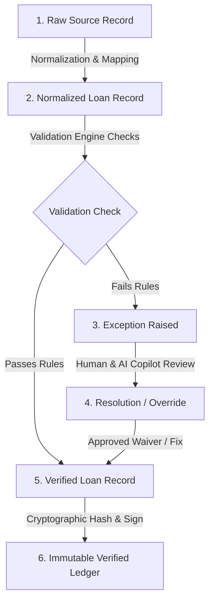

# Database Data Model Design

This document details the MongoDB data model for the **Loan Data Verification Copilot**. We utilize **Mongoose** to provide schema validation, typed models, and relationships.

---

## 1. Document Lifecycle

A loan tape record transitions through multiple stages from raw input ingestion to final certified verification.

1. **Raw Loan Record**: The original row parsed from uploaded spreadsheets (`loan_tape.csv`, `servicer_update.csv`, etc.). Stored in `LoanSourceRecord` with full preservation of raw formats and data types.
2. **Normalized Loan Record**: Normalized, mapped, and parsed representation of the loan (standardizing dates, currencies, state codes, and identifiers) stored in the primary `Loan` collection.
3. **Validation**: The validation engine automatically runs a suite of JSON-configurable validation rules against the normalized record.
4. **Exception**: If any rules fail (e.g. Maturity Date prior to Origination Date), one or more `Exception` records are created and linked to the loan.
5. **Human/AI Review**: Reviewers leverage AI Recommendations (suggested actions, severity, explanation, suggested value corrections) to either resolve the issue (by overriding or updating the loan data) or waive the exception with documentation.
6. **Verified Loan**: Once all exceptions are resolved, the record is finalized and a snapshot is written into the `VerifiedLoan` collection, marked with a cryptographic integrity hash.

---

## 2. Entities & Data Models

### 2.1 User
* **Purpose**: Manages access control, identity, and logging for operational tracking.
* **Fields**:
  * `_id` (`ObjectId`): Unique MongoDB identifier.
  * `email` (`String`, Unique, Indexed): Registered email address.
  * `passwordHash` (`String`): Securely hashed credential using bcrypt.
  * `name` (`String`): User's full name.
  * `role` (`String`): Enums of `operator` (ingestion, basic repairs), `reviewer` (exception handling, waiver approvals), or `consumer` (read-only audit views).
* **Relationships**:
  * Initiator of `ImportJob`, `Review`, `VerifiedLoan`, and `AuditLog`.

### 2.2 Loan
* **Purpose**: The core canonical representation of normalized active loan data in the system.
* **Fields**:
  * `loanId` (`String`, Unique, Indexed): Primary system-wide identifier.
  * `borrowerName` (`String`): Name of the borrower.
  * `originationDate` (`Date`): Origination date.
  * `maturityDate` (`Date`): Loan maturity date.
  * `originalPrincipal` (`Number`): The initial loan amount.
  * `currentBalance` (`Number`): Remaining unpaid principal balance.
  * `interestRate` (`Number`): Interest rate (decimal or percentage representation).
  * `paymentStatus` (`String`): Current payment status (e.g. Current, Delinquent, Paid Off).
  * `dpd` (`Number`): Days Past Due.
  * `propertyState` (`String`): State code where property is located (e.g. NY, CA).
  * `verificationStatus` (`String`): Enum of `unverified`, `in_review`, `verified`, `exception`.
  * `documents` (`Array`): Sub-documents detailing associated loan documents.
* **Indexes**:
  * `loanId`: 1 (Ascending, Unique)
  * `verificationStatus`: 1

### 2.3 LoanSourceRecord
* **Purpose**: Immutable history of ingestion inputs to preserve line-level raw source material.
* **Fields**:
  * `loanId` (`String`, Indexed): The identifier the raw data refers to.
  * `jobId` (`ObjectId`): Ref to the associated `ImportJob`.
  * `sourceType` (`String`): Enum of `loan_tape`, `servicer_update`, `document_manifest`.
  * `rawContent` (`Map`/`Object`): The raw CSV values as strings.
  * `normalizedContent` (`Map`/`Object`): Values after data cleansing.
  * `status` (`String`): Enum of `raw`, `normalized`, `error`.

### 2.4 ImportJob
* **Purpose**: Tracks batch upload sessions and statistics.
* **Fields**:
  * `fileName` (`String`): The name of the file uploaded.
  * `fileType` (`String`): Enum of `loan_tape`, `servicer_update`, `document_manifest`.
  * `status` (`String`): Enum of `pending`, `processing`, `completed`, `failed`.
  * `totalRecords` (`Number`): Total records in the file.
  * `processedRecords` (`Number`): Number of successfully parsed records.
  * `failedRecords` (`Number`): Number of records that failed ingestion.
  * `uploadedBy` (`ObjectId`): Ref to the `User` who uploaded.
  * `errorSummary` (`String`): Ingestion level stacktrace or parsing error message.

### 2.5 Exception
* **Purpose**: Records any specific validation rule failures identified during processing.
* **Fields**:
  * `loanId` (`String`, Indexed): Ref to target loan.
  * `sourceRecordId` (`ObjectId`): Ref to the specific `LoanSourceRecord` that failed.
  * `ruleId` (`String`): Reference to the validation rules schema (e.g., `RULE_001`).
  * `ruleName` (`String`): Short name of the rule.
  * `severity` (`String`): Enum of `low`, `medium`, `high`, `critical`.
  * `description` (`String`): Readable description of the failure.
  * `status` (`String`): Enum of `open`, `investigating`, `resolved`, `waived`.
  * `resolutionNote` (`String`): Note input by user justifying resolution.
  * `resolvedBy` (`ObjectId`): Ref to the `User` who resolved it.
  * `resolvedAt` (`Date`): Timestamp of resolution.
  * `aiRecommendationId` (`ObjectId`): Ref to the related `AIRecommendation` generated.

### 2.6 Review
* **Purpose**: Stores historical reviewer actions and notes.
* **Fields**:
  * `loanId` (`String`, Indexed): The related loan.
  * `reviewerId` (`ObjectId`): Ref to the `User`.
  * `action` (`String`): Enum of `approve_verification`, `waive_exception`, `request_correction`.
  * `exceptionId` (`ObjectId`): Ref to target `Exception` (optional).
  * `notes` (`String`): Notes or justifications written by the reviewer.

### 2.7 AIRecommendation
* **Purpose**: Scaffolding details for copilot recommendations generated via the AI Service.
* **Fields**:
  * `exceptionId` (`ObjectId`, Indexed): Ref to target `Exception`.
  * `suggestedAction` (`String`): Enum of `approve`, `waive`, `correct`.
  * `confidence` (`Number`): Float indicating confidence score (0.0 to 1.0).
  * `explanation` (`String`): Detailed reasoning in markdown.
  * `suggestedValue` (`Mixed`): Proposed correct value (if correction is recommended).
  * `modelUsed` (`String`): Enum of `gemini`, `openai`, `local_custom`.

### 2.8 VerifiedLoan
* **Purpose**: Final read-only certified table representing verified records.
* **Fields**:
  * `loanId` (`String`, Unique, Indexed): Primary system-wide identifier.
  * `canonicalRecord` (`Object`): Complete snapshot of the finalized verified fields.
  * `hashedValue` (`String`): SHA-256 integrity hash of the canonical record.
  * `verifiedBy` (`ObjectId`): Ref to the `User` who signed off.
  * `verifiedAt` (`Date`): Ingestion/verification timestamp.
  * `auditTrailIds` (`Array` of `ObjectId`): Ref list to associated `AuditLog` records.

### 2.9 AuditLog
* **Purpose**: System-wide compliance ledger recording every operational modification.
* **Fields**:
  * `userId` (`ObjectId`): Ref to the `User` (empty if system process).
  * `action` (`String`, Indexed): Event type (e.g. `UPLOAD_FILE`, `WAIVE_EXCEPTION`, `VERIFY_LOAN`).
  * `entityType` (`String`): Target model name.
  * `entityId` (`ObjectId`): MongoDB ref identifier.
  * `changeSummary` (`String`): Descriptive summary.
  * `diff` (`Object`): Holds `before` and `after` field snapshots.
  * `ipAddress` (`String`): Client IP address.
